Sesja Zima 2023
===============

XAI
---

### Lectures
*   [01\_introduction.html](https://htmlpreview.github.io/?https://github.com/mim-uw/eXplainableMachineLearning-2023/blob/main/Lectures/01_introduction.html)
    *   Methods can be
        *   Interpretable by design (kNN, linear regression, naive bayes)
        *   Model specific (e. g. gradient-flow based methods in Neural Networks)
        *   **Model agnostic ← main focus of this lecture**
    *   The pyramid of explainability: 
            
        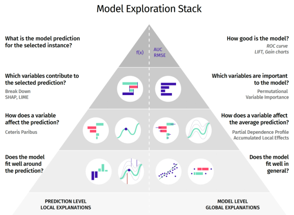
*   [02\_shap.html](https://htmlpreview.github.io/?https://github.com/mim-uw/eXplainableMachineLearning-2023/blob/main/Lectures/02_shap.html)
    *   Paper (A Unified Approach to Interpreting Model Predictions) introduces SHAP, based on the notion of Shapley values introduced in game theory
    *   SHAP is placed in (Model Prediction) x (Variable attribution) spot in XAI Pyramid
    *   SHAP corresponds to panel C on the following image
  
        
    * Shapley values obey:
      * Efficiency, i.e. all contributions sum up to the final reward
      * Symmetry, i.e. if players _i_ and _j_ contribute in the same way to all coalitions, they get the same reward
      * _Dummy_, if a player doesn't contribute in any coalition, their reward is 0 
      * Additivity, i.e. ...
    * When we want to use Shapley values with an ML model we have:
      * The reward to be distributed:
      
        
      * Payoff value function for coalition S: 
        
        
      * And Shapley values via permutations:

        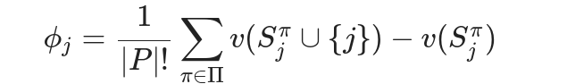
    * Accurate computation of Shapley values is very time consuming, so other approximating approaches are used
    * Kernel-SHAP is one such approach - can be thought of as adaptation of LIME
      * The interpretable space describes whether a given variable enters a coalition
      * If the variable doesn't enter the coalition, its value is sampled from the dataset
      * The linear regression coefficients of the fitted model are estimated Shapley values
    * Tree SHAP:
      * 
    * Take home message:
      
      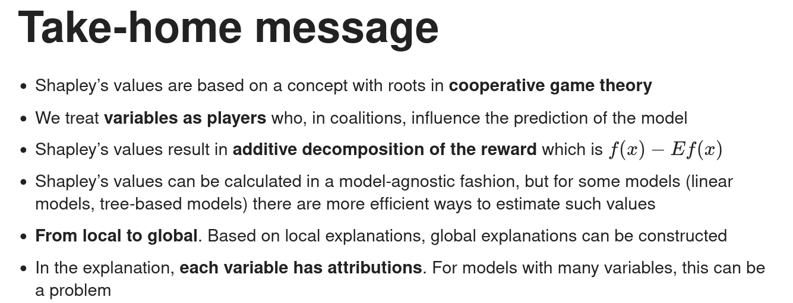
*   [03\_lime.html](https://htmlpreview.github.io/?https://github.com/mim-uw/eXplainableMachineLearning-2023/blob/main/Lectures/03_lime.html)
    *  LIME is a local explanation method focusing on the importance of features (just like SHAP)
    *  LIME is visualize on panel B in the following picture
       
       
    * In contrast with SHAP, here the attributions don't necessarily add up to 1
    * In this approach:
      * A sample is selected
      * The sample is encoded into binary (interpretable) space, e.g. split into superpixels
      * N samples around the actual datapoint are created by masking some features. Original model's outputs are computed for the artificial samples
      * K-LASSO model is created and fit to the binary representations of the artificial datapoints
      * K-LASSO coefficients corresponding to the elements of the the interpretable space are features attributions
    * Common ways of creating a binary interpretable space:
      * Vision: superpixels
      * NLP: words / groups of words
      * Tabular data: continuous variables can be discretized (e.g.  split into quartiles). Categorical variables can be one-hot encoded.
    * There are some methods for creating global explanations based on LIME (e.g. Submodular Pick)
    * A problem with LIME is that it does not account for interactions between features, being an additive model
    * *Anchors* is a method aimed at fixing this issue: it searches for *sufficient conditions* for the model to produce the actual output. E.g. in the following picture we can see a set of features *sufficient* for the model to decide a picture shows a dog

    

    * Another local method is *LORE* (Local Rule-Based Explanations). With the help of a genetic algorithm, a set of points representing both class 1 and 0 similar to a given point *x* is created. Then, a decision tree is trained and used to create both an *explanation* and a *conterfactual explanation* (what should be changed so that the model prediction for *x* flips).
    * Take home message: 
        
        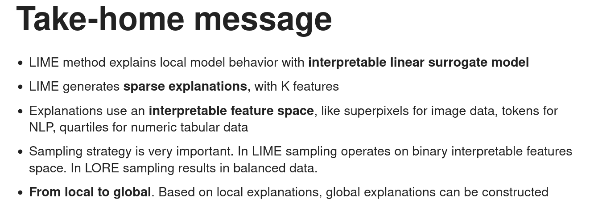
*   [04\_pdp.html](https://htmlpreview.github.io/?https://github.com/mim-uw/eXplainableMachineLearning-2023/blob/main/Lectures/04_pdp.html)
    * CP, PDP and ALE live on the third level of the XAI pyramid:

      
    * These methods correspond to panel A in the following illustration:
      
      
    * Motivation: methods like SHAP or LIME don't tell us _what if_ the value of some variable was higher. That's why we turn to methods like CP.
    * CP: For a given point X we create an explanation:

      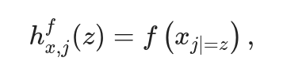
    * There can be hundreds of variables with uninteresting CP profiles - a good way to select which ones to visualize is based on amplitude of oscillations
    * CP can be especially convenient for comparing models
    * CP has the advantage of being a simple method, it means however that it cannot explain interactions between variables. It's also prone to creating OOD-samples.
    * PDP is a method of global explanation - we average CP profiles to aggregate global model response:

      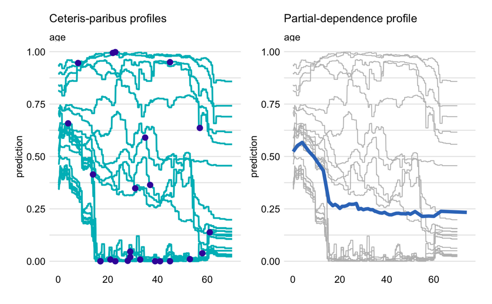
    * PDPs share the pros and cons of CPPs, i.a. averaging over marginal distribution
    * Instead of averaging over marginal distribution we should focus on conditional distribution:

      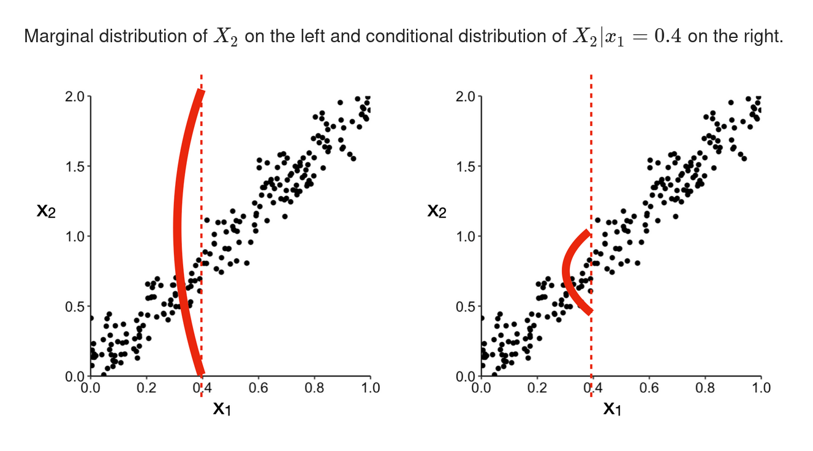
    * We can do that by bucketing the explained variable and only considering datapoints withing the corresponding bucket when computing the PDP for a given value
    * This method is called Marginal Effects
    * A problem appears - marginal effects carry the cumulative effect of all correlated variables. How do we distil the indivifual contributions? This is where ALE (Accumulated Local Effects) comes in.
    * 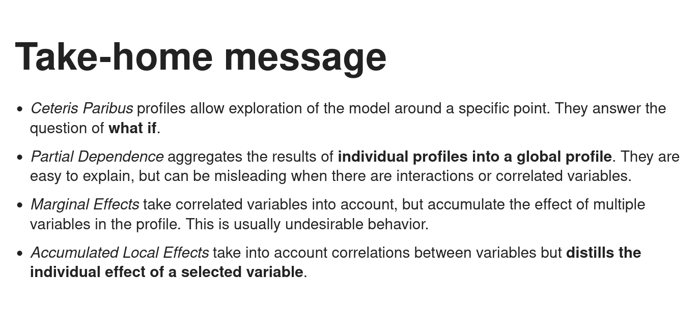
*   [05\_vip.html](https://htmlpreview.github.io/?https://github.com/mim-uw/eXplainableMachineLearning-2023/blob/main/Lectures/05_vip.html)
    *   An issue with all the methods up to this point is that they only consider one model to infer the importance of variable
    *   
*   [06\_fairness.html](https://htmlpreview.github.io/?https://github.com/mim-uw/eXplainableMachineLearning-2023/blob/main/Lectures/06_fairness.html)
    *   There are many possible source of bias in the data:
        *   Historical bias
        *   Representation bias
        *   Measurement bias
        *   Evaluation bias
        *   Proxy bias
    *   Sometimes bias can be desirable (e.g. drugs which work better in females than males)
    *   Bias can be appear on all levels of model-preparation pipeline:
        *   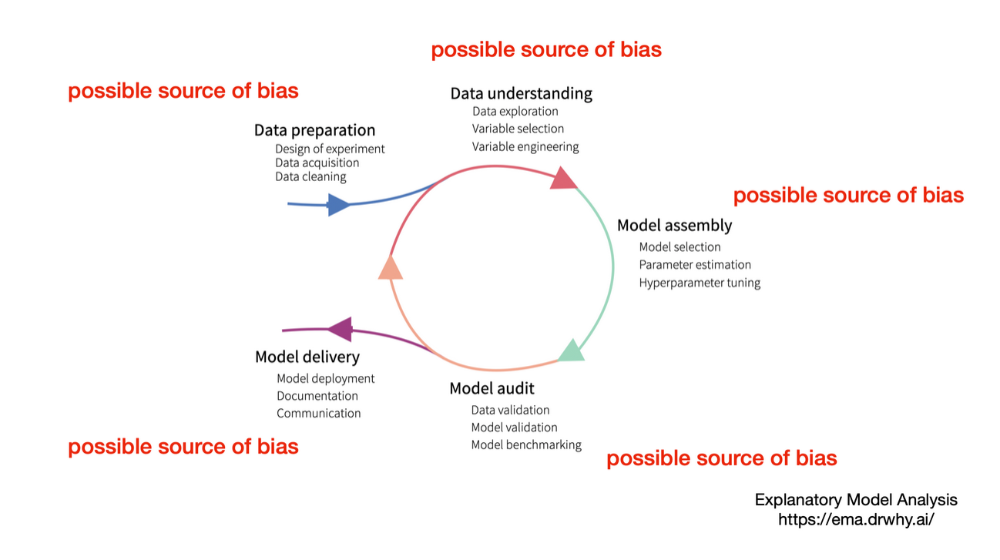
    *   Fairness metrics:
        *   Most of the time we use a _four-fith rule_ - selection rate of any disadvantaged group should be between $4/5$ and $5/4$ of the rate of the group with the highest rate
        *   _Group fairness / statistical parity / independence / demographic parity_:
            *   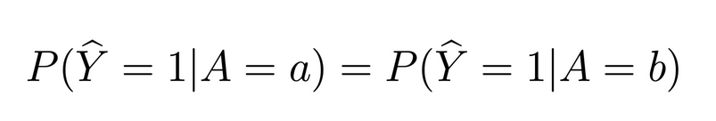
            *   Predicted class is independent from protected attribute
        *   _Equal opportunity_:
            *   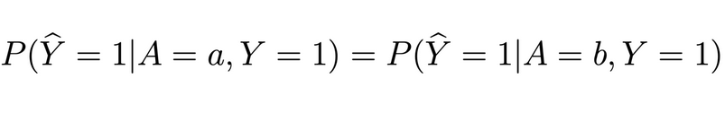
        *   _Predictive equality_:
            *   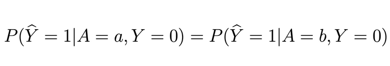
        *   _Equalized odds, Separation, Positive Rate Parity_:
            *   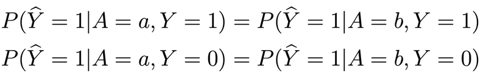
        *   _Positive Predictive Parity_:
            *   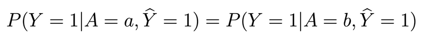
        *   _Negative Predictive Parity_:
            *   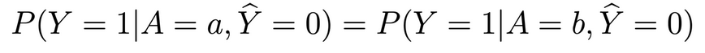
        *   _Predictive Rate Parity, Sufficiency_:
            *   
        *   Except for trivial cases Independence, Separation and Sufficiency criterions at the same time is impossible (the impossibility theorem)
        *   In fact each two of the above (Ind, Sep, Suf) are mutually exclusive
        *   Fairness metrics can be summarised in a single graph:
            *   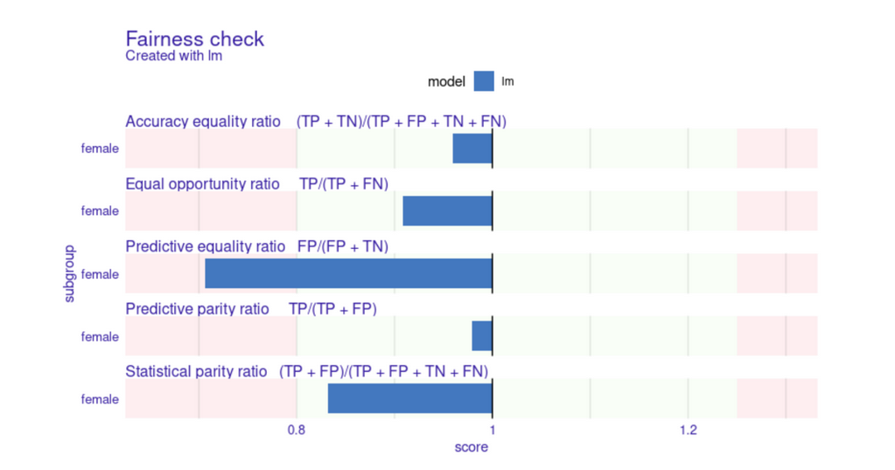
        *   How can we mitigate bias?
            *   Data Pre-processing, e.g. subsampling or case weighting
            *   Model In-processing, modify criterion e.g. through adversarial training
            *   Model Post-processing, modify model scores, e.g. use different thresholds
        *   Take-home message:
            *   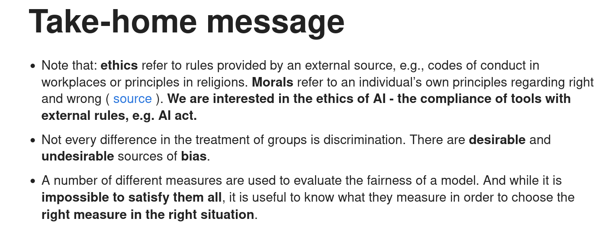
*   [07\_networks.html](https://htmlpreview.github.io/?https://github.com/mim-uw/eXplainableMachineLearning-2023/blob/main/Lectures/07_networks.html)
    *   NNs are differentiable - we can compute the gradient of prediction wrt to the input (e.g. for each pixel in the input)
    *   One method of computing NN explanation is LRP (Layer-Wise Relevance Propagation), which propagates relevance of pixels through the layers of a network using gradients
    *   Another method is IG (Integrated Gradients)
        *   We take N (50-300) steps from baseline (e.g. all zeros) to the target image
        *   Integrate (accumulate) gradients along the path
        *   This approach satisfies:
            *   Completeness: sum of attributions equals the difference between actual output and baseline
            *   Sensitivity: if baseline and input differ in one feature and their predictions are different, then the feature's attribution is non-zero
            *   Implementation invariance: if two neural networks are functionally equivalent (same outputs for the same inputs), their IG is the same
    *   A simple improvement to gradient-base methods is SmoothGrad
        *   Generate multiple samples around the input by adding noise
        *   For each sample generate feature attribution (e.g. with IG)
        *   Average the attributions over samples
    *   Take-home message:

        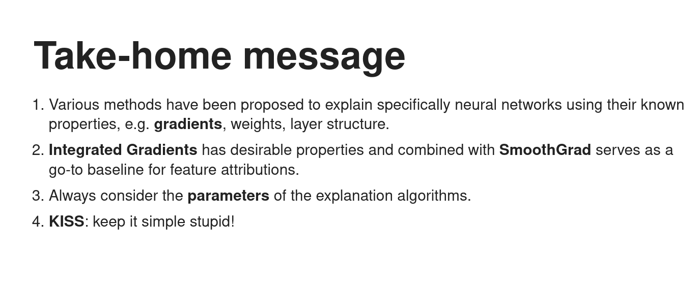
*   [08\_evaluation.html](https://htmlpreview.github.io/?https://github.com/mim-uw/eXplainableMachineLearning-2023/blob/main/Lectures/08_evaluation.html)
    *   How should we evaluate XAI methods? There is no ground truth.
    *   `Quantus` is a package implementing XAI-methods metrics in Python 
    *   Notions of explainability:
        *   Axiomatic - does explanation fulfill certain axiomatic properties (e.g. Completeness or Input Invariance)
        *   Faithfulness - do explanations actually follow the predictive behaviour of the model
        *   Robustness - are explanations stable when subject to slight perturbations (given the model output stays approximately constant)
        *   Complexity - are the explanations small (only a few features explain a prediction)
        *   Randomization - some model / data randomization tests, "Sanity Checks for Saliency Maps"
    *   Take-home message
        
        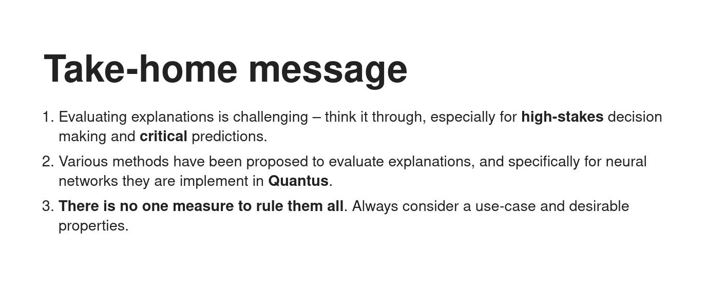
### Homeworks
#### Shapley Values
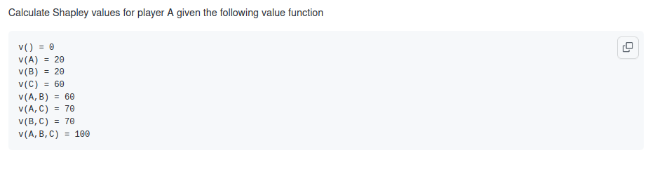

#### PDP, ME, ALE
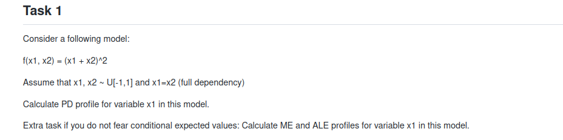

#### Fairness
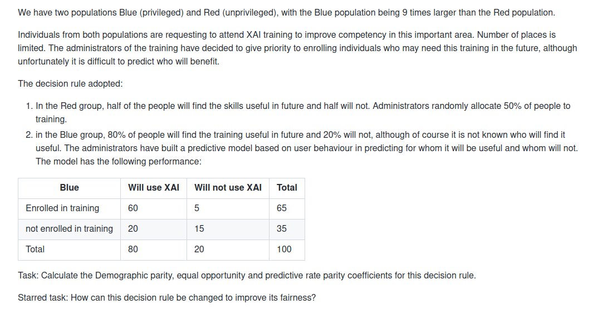

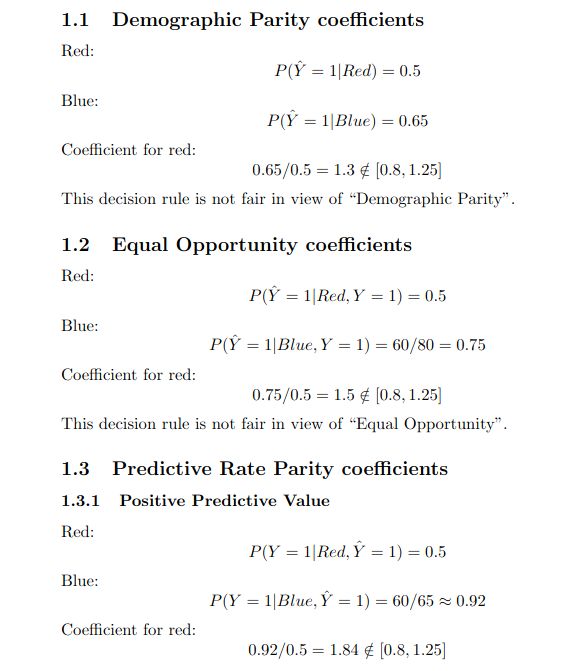

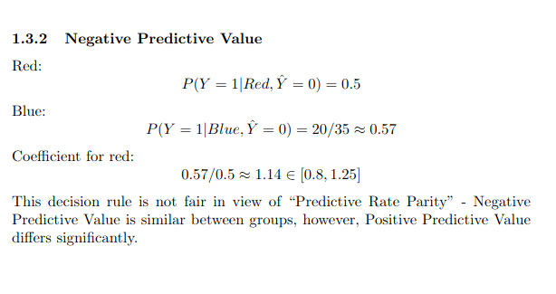
